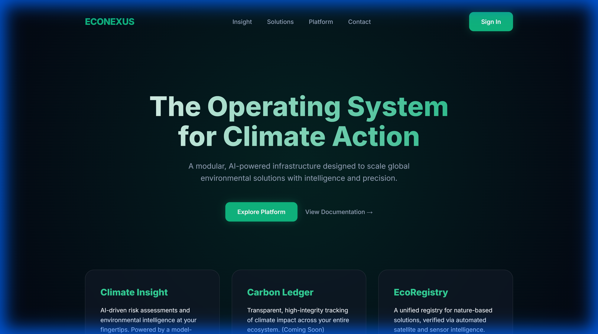

# EcoNexus: Operating System for Climate Action

EcoNexus is a production-ready, highly scalable Django-based platform designed to host multiple modular tools for climate action. It features a sophisticated AI abstraction layer, allowing for seamless model switching (Gemini, OpenAI, DeepSeek, etc.) without impacting business logic.

## 🚀 Key Features

- **Modular Monolith Architecture**: Independent domain-specific modules (e.g., Climate Insight) hosted within a unified core.
- **Model-Agnostic LLM Engine**: A Strategy Pattern implementation for AI providers, managed via a central factory.
- **Production-Ready Security**: 
  - Rate limiting (Anon: 100/day, Auth: 1000/hour).
  - Custom cloud storage URL validation (No binary storage).
  - `django-allauth` for Google Social Login.
- **Scalable Infrastructure**: Configured for free-tier deployment on **Render** (App) and **Neon.tech** (PostgreSQL).

## 🛠 Tech Stack

- **Framework**: Django 5.x, Django REST Framework (DRF)
- **Database**: PostgreSQL (Neon.tech)
- **Authentication**: `django-allauth`
- **AI Integration**: Google Gemini, OpenAI, DeepSeek (via custom factory)
- **Deployment**: Render, WhiteNoise (Static Management)

## 📁 Directory Structure

```text
EcoNexus/
├── config/                 # Core settings & URL routing
├── core/                   # Shared logic & LLM Engine
│   ├── llm_engine/         # THE AI ABSTRACTION LAYER
│   │   ├── base.py         # Abstract Base Provider
│   │   ├── factory.py      # Provider initialization logic
│   │   └── providers/      # Concrete AI implementations
│   └── utils.py            # Validators & shared helpers
├── users/                  # Custom User Model & Auth
├── modules/                # Domain-specific apps
│   └── climate_insight/    # Phase 1: Risk Assessment
├── manage.py
└── render.yaml             # Deployment blueprint
```

## ⚙️ Setup & Installation

### 1. Clone & Environment
```bash
git clone <repository-url>
cd EcoNexus-Core
python -m venv .venv
source .venv/bin/activate  # On Windows: .venv\Scripts\activate
pip install -r requirements.txt
```

### 2. Configuration
Copy `.env.template` to `.env` and fill in your API keys and configuration.

```bash
cp .env.template .env
```

### 3. Database & Migrations
```bash
python manage.py makemigrations users core climate_insight
python manage.py migrate
```

### 4. Run Locally
```bash
python manage.py runserver
```

## 🤖 The AI Engine

To switch AI models, simply change the `LLM_PROVIDER` in your `.env` file:
- `LLM_PROVIDER=gemini`
- `LLM_PROVIDER=openai`
- `LLM_PROVIDER=deepseek`

The system will automatically initialize the correct provider using the strategy pattern.

## 📊 Modules

### Climate Insight
- **Endpoint**: `POST /api/climate/assess-risk/`
- **Purpose**: Generates climate risk assessments for specific locations.
- **Example Payload**:
  ```json
  {
    "location": "Miami, FL",
    "risk_type": "Sea Level Rise"
  }
  ```

## 🚢 Deployment

### Live Demo: [https://eco-nexus-core.vercel.app](https://eco-nexus-core.vercel.app)



This project is deployed using a **Totally Free Stack**:
-   **Frontend/Backend Application**: [Vercel](https://vercel.com) (Serverless Python)
-   **Database**: [Neon.tech](https://neon.tech) (Serverless PostgreSQL)

### How to Deploy Your Own
1.  **Fork** this repository.
2.  **Create a Neon Database**: Get the connection string.
3.  **Deploy on Vercel**:
    -   Import the repository.
    -   Add Environment Variables: `DATABASE_URL` (from Neon), `SECRET_KEY`, `DEBUG=False`.
    -   Deploy!
4.  **Run Migrations**: Connect locally to the Neon DB and run `python manage.py migrate`.

See [DEPLOYMENT.md](DEPLOYMENT.md) for the detailed step-by-step guide.

## 🛡 Security & Constraints
- **Zero Binary Storage**: All evidence must be provided via URLs (GDRIVE, Dropbox, etc.).
- **URL Validation**: `core.utils.validate_cloud_storage_url` ensures links are from trusted domains.

---
Built with 🌍 for a sustainable future.
